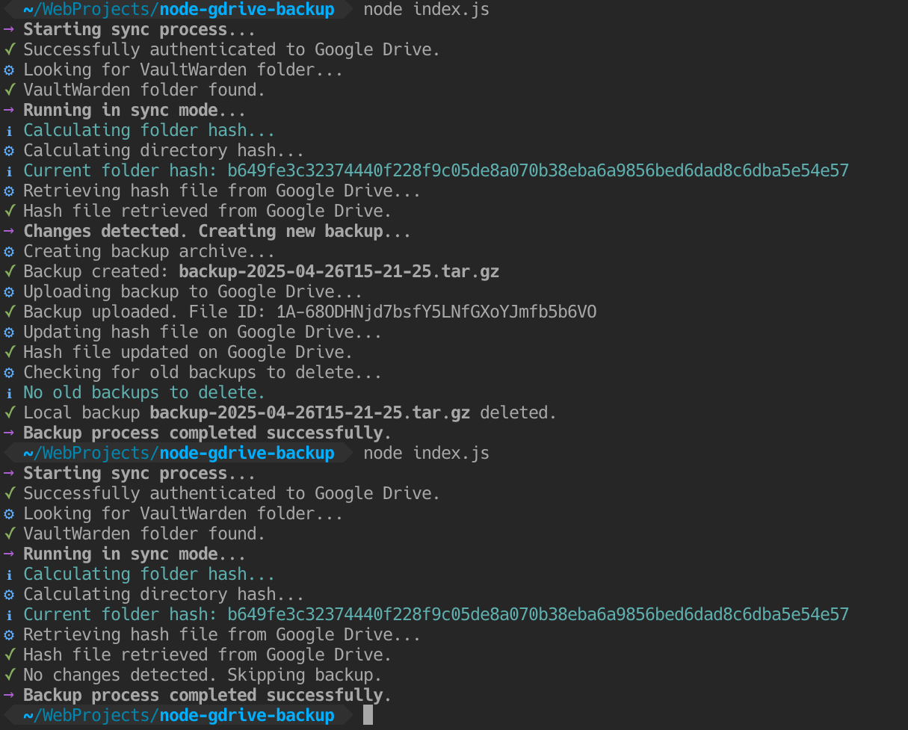

# 🚀 Google Drive Backup & Sync

A simple yet powerful Node.js utility to backup and sync folders to Google Drive with Docker support.

<p align="center">
  
</p>

## ✨ Features

- 📦 Backup folders to Google Drive
- 🔄 Smart sync mode with change detection
- 🧹 Automatic cleanup of old backups
- 🐳 Docker support
- 🔒 Secure authentication with service accounts

## 🛠️ Setup Guide

### 1. Google Drive API Setup

1. Go to [Google Cloud Console](https://console.cloud.google.com/)
2. Create a new project or select an existing one
3. Enable the Google Drive API:
   - Navigate to "APIs & Services" > "Library"
   - Search for "Google Drive API"
   - Click "Enable"
4. Create a Service Account:
   - Go to "APIs & Services" > "Credentials"
   - Click "Create Credentials" > "Service Account"
   - Fill in the required details
5. Generate Key:
   - Open the created service account
   - Go to "Keys" tab
   - Add new key > Create new key > JSON
   - Download the key file
6. Share Drive Folder:
   - Create a folder in Google Drive
   - Share it with the service account email
   - Give "Editor" access

### 2. Environment Configuration

Create a `.env` file with the following settings:

```env
# Google Drive API credentials (paste your service account JSON here)
SERVICE_ACCOUNT_JSON='{"type":"service_account","project_id":"your-project-id","private_key_id":"your-key-id","private_key":"your-private-key","client_email":"your-service-account@your-project.iam.gserviceaccount.com"}'

# Path to backup folder (use /data when running in Docker)
FOLDER_TO_BACKUP='/data'

# Name of the backup folder in Google Drive
GDRIVE_FOLDER_NAME='Backups'

# Maximum number of backups to keep
MAX_BACKUPS='5'

# Enable sync mode (optional)
# SYNC_MODE='true'
```

## 🚀 Running the Application

### Using Node.js

```bash
# Install dependencies
npm install

# Run the backup
node index.js
```

### Using Docker

[](https://hub.docker.com/repository/docker/kp2016/gdrive-backup/)

```bash
docker run --rm \
  -v /path/to/folder-to-backup:/data \
  -v /path/to/.env:/app/.env \
  kp2016/gdrive-backup:latest
```

## 🔄 Operation Modes

### Backup Mode (Default)
- Creates a new backup on each run
- Maintains the specified number of recent backups
- Automatically removes older backups

### Sync Mode
- Enable by setting `SYNC_MODE='true'`
- Only creates backups when changes are detected
- Uses SHA-256 hashing for change detection
- Restores from latest backup if target folder is empty

___

#### Tips

- Keep your service account credentials secure
- Test the backup and restore process
- Use cron jobs for scheduled backups
- Monitor the backup logs

####  Example Cron Job

Add this to your `crontab -e` for daily backups at 2 AM:
```bash
0 2 * * * docker run --rm -v /path/to/folder-to-backup:/data -v /path/to/.env:/app/.env kp2016/gdrive-backup:latest
```

## License

```
MIT License

Copyright (c) 2025 Kaustubh Patange

Permission is hereby granted, free of charge, to any person obtaining a copy
of this software and associated documentation files (the "Software"), to deal
in the Software without restriction, including without limitation the rights
to use, copy, modify, merge, publish, distribute, sublicense, and/or sell
copies of the Software, and to permit persons to whom the Software is
furnished to do so, subject to the following conditions:

The above copyright notice and this permission notice shall be included in all
copies or substantial portions of the Software.

THE SOFTWARE IS PROVIDED "AS IS", WITHOUT WARRANTY OF ANY KIND, EXPRESS OR
IMPLIED, INCLUDING BUT NOT LIMITED TO THE WARRANTIES OF MERCHANTABILITY,
FITNESS FOR A PARTICULAR PURPOSE AND NONINFRINGEMENT. IN NO EVENT SHALL THE
AUTHORS OR COPYRIGHT HOLDERS BE LIABLE FOR ANY CLAIM, DAMAGES OR OTHER
LIABILITY, WHETHER IN AN ACTION OF CONTRACT, TORT OR OTHERWISE, ARISING FROM,
OUT OF OR IN CONNECTION WITH THE SOFTWARE OR THE USE OR OTHER DEALINGS IN THE
SOFTWARE.
```
